# Trakya Bilmuh - Non Official University Notification and Announcements App

Thanks to this project, students can join channels created by teachers and they can get inform about lessons, internships and job opporunities.

#### The Project consists of 3 parts:

- Backend: Java Spring Boot
- Frontend: React JS
- Mobile: Android Kotlin

### How to run

#### clone the project: https://github.com/gurkanucar/trakya-bilmuh-be

```bash
  git clone https://github.com/gurkanucar/trakya-bilmuh-be
  cd trakya-bilmuh-be
```

#### run app

```bash
  mvn spring-boot:run
```

### Frontend:

[https://github.com/gurkanucar/trakya-bilmuh-fe](https://github.com/gurkanucar/trakya-bilmuh-fe)


## Example Images

#### Mobile App
<p float="left">

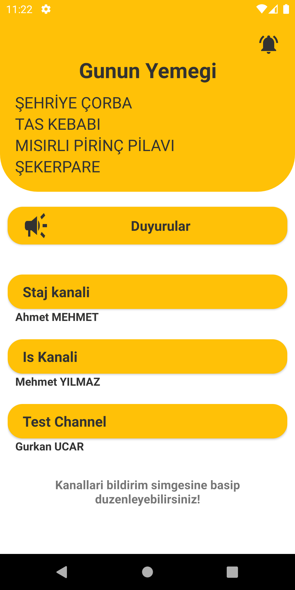

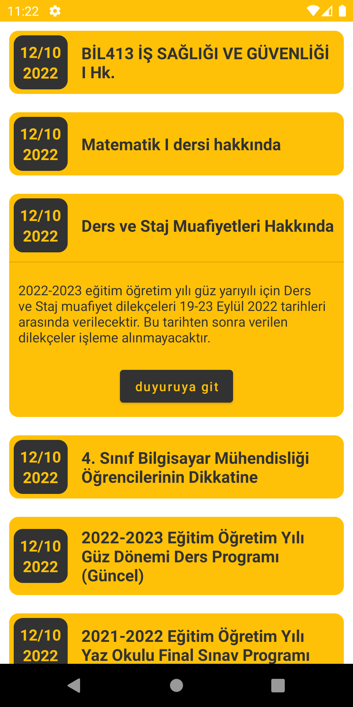

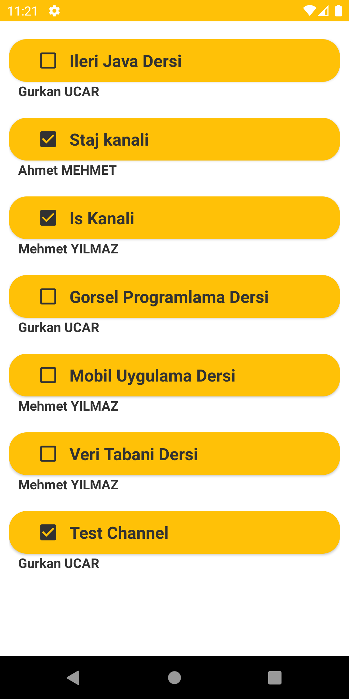

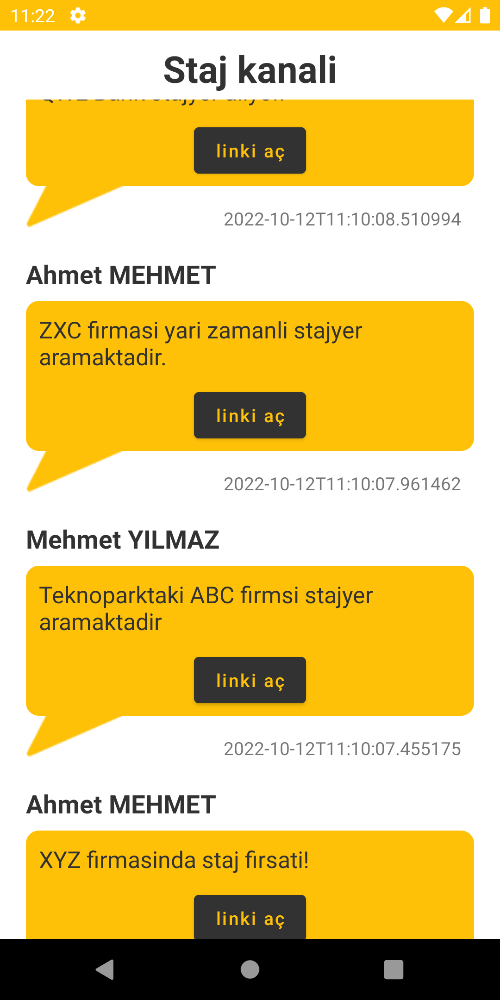

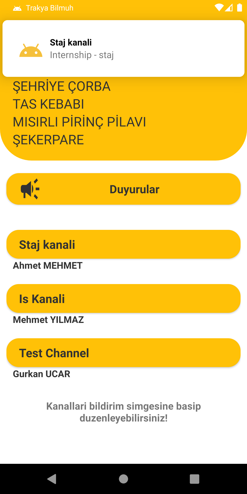

</p>

#### Panel

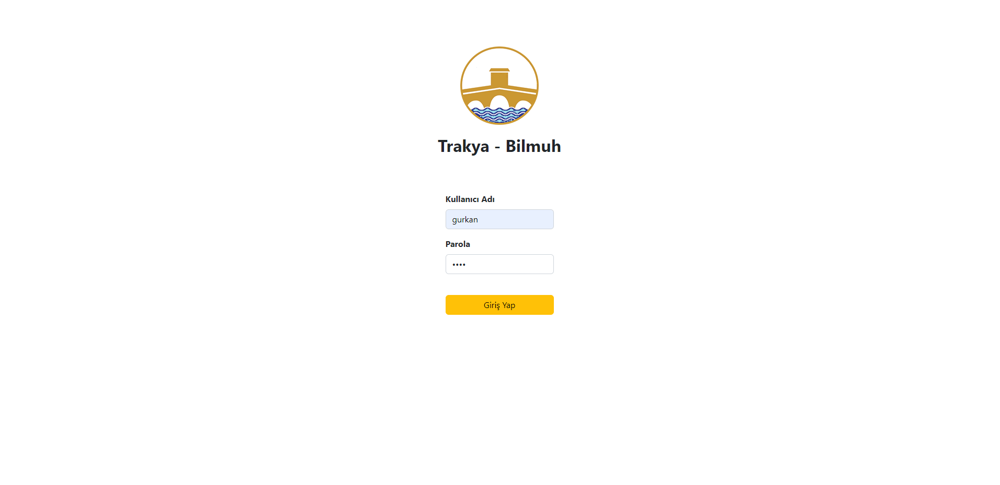

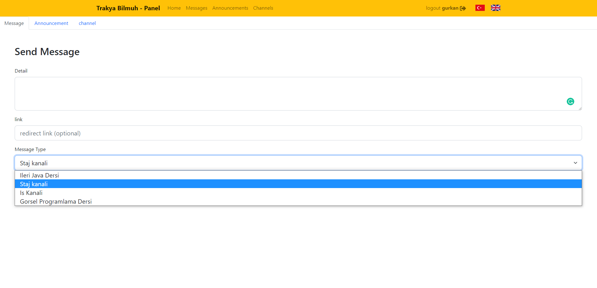

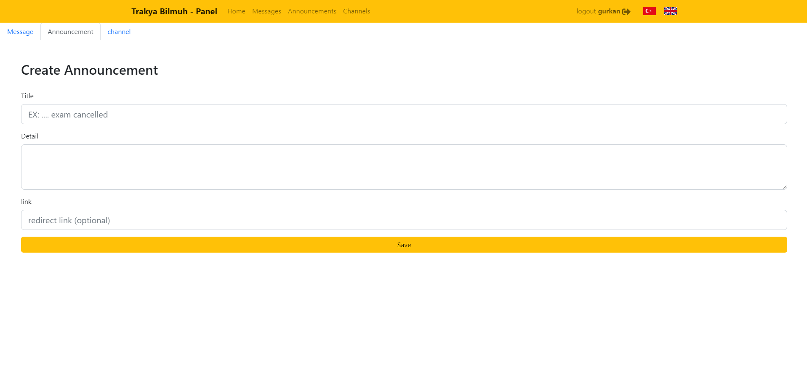

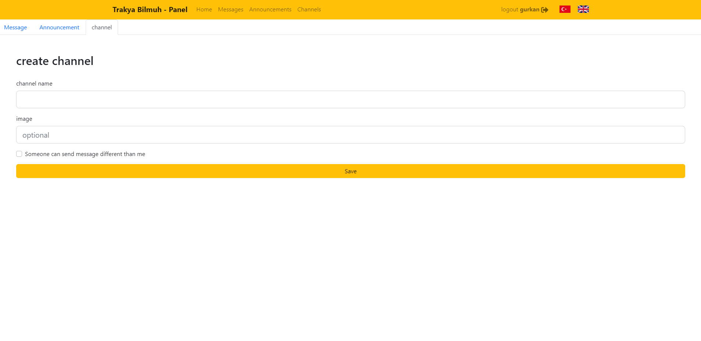

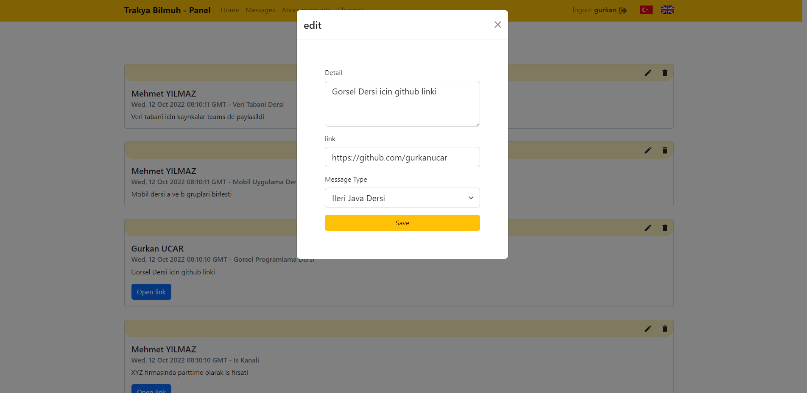

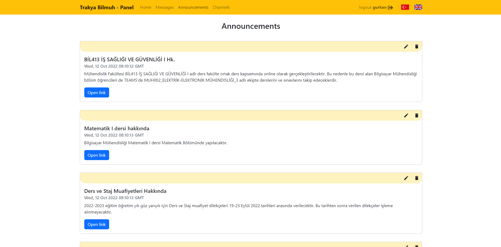
